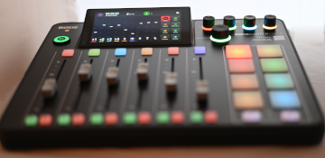
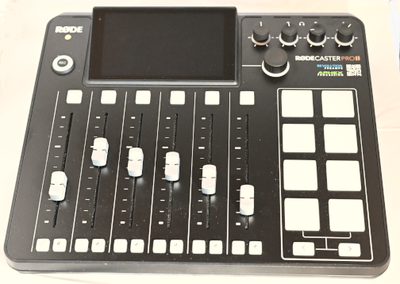
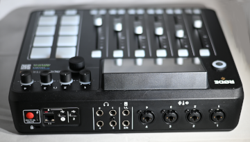
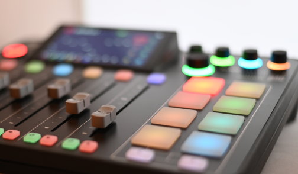

## Audio-Interfaces und Mischpulte

### Anwendungsempfehlung

##### Für wen ist dieses Gerät

##### Für wen ist dieses Gerät eher nicht

## Der RØDECaster Pro II

### Anwendungsempfehlung
Diese Empfehlung soll eine Idee geben, wofür diese Gerät gedacht ist und sollte nicht als Ausschlusskriterium dienen.  

##### Für wen ist dieses Gerät
Das Gerät ist für ambitionierte Podcasterinnen und Podcaster gedacht, die semi-professionelle oder professionelle Aufnahmen machen möchten und dabei auf einen einfache Bedienung Wert legen. Es ermöglicht sind viele Dinge, die sonst zusätzlichen Aufwand benötigen würden (Remote-Zuschaltungen, interne Unterhaltungen, Soundeinspielungen etc. …) 

##### Für wen ist dieses Gerät eher nicht
Obwohl das Gerät auch protabel ist, sollten Personen die eher mobile Aufnahmen machen möchten, sich die Anschaffung dieses Gerätes überlegen.  Das Gerät ist zwar sehr Anwender:innen freundlich aber durch den relativ hohen Anschaffungspreis ist es für ein einfaches ausprobieren eines möglichenPodcastprojekt nicht unbedingt geeignet. 

## Der RØDECaster Pro II im Detail
 
Der [RRØDECaster Pro II](https://rode.com/de/interfaces-and-mixers/rodecaster-series/rodecaster-pro-ii?variant_sku=RCPIIW) ist augenblicklich (Stand Jan 2025) eines der besten aber auch teuersten Audio-Interface um Podcasts aufzunehmen. Bereits der Vorgänger der [RØDECaster Pro I](https://rode.com/de/interfaces-and-mixers/rodecaster-series/rodecaster-pro) ist ein hervorragendes Gerät. Es gibt auch noch den kleinen Bruder des Pro, den [RØDECaster Duo](https://rode.com/en-us/interfaces-and-mixers/rodecaster-series/rodecaster-duo?variant_sku=RCDUOW). Das Gerät ist etwas kleiner und hat zwei Mikrofoneingänge und zwei Fader weniger und das eher für Videoproduktionen gedachte [RØDECaster Video](https://rode.com/en-us/about/news-info/introducing-the-rodecaster-video-all-in-one-production-console)

**Abbildung des RRØDECaster Pro II** _In diesem Bild ist das Gerät im eingeschaltetem Zustand zu sehen_ 

In diesem Abschnitt geht es aber um den aktuellen Nachfolger den [RØDECaster Pro II](https://rode.com/de/interfaces-and-mixers/rodecaster-series/rodecaster-pro-ii?variant_sku=RCPIIW)
Dieses Mischpult ist noch flexibler als der Vorgänger und bietet viele Funktionen, die das Podcasten einfacher gestalten.

Einen sehr umfänglichen Überblick bietet [Der ultimative Rodecaster Pro II Workshop](https://media.ccc.de/v/38c3-der-ultimative-rodecaster-pro-ii-workshop/playlist) vom 38C3 aus dem Dezember 2024.
Wer allerdings gerne eine Zusammenfassung möchte, kann hier einige Informationen erhalten (Siehe auch orginal Beitrag von Tim Pritlove im [Sendegate](https://sendegate.de/t/das-ultimative-rodecaster-pro-ii-review/16825)):

### Funktionsübersicht

Zunächst ein Überblick über die Tasten und Anschlüsse (Prors) des Geräts und deren Funktionalitäten.

#### Komponenten

Das Gesamtsystem besteht aus:

* dem RØDECaster Pro II Gerät mit USB-C Netzteil
* der "[RØDE Central]( https://rode.com/de/apps/rode-central)" Desktop App für [macOS]( https://update.rode.com/central/RODE_Central_MACOS.zip ) und [Windows]( https://update.rode.com/central/RODE_Central_WIN.zip )
* der "RØDE Central Mobile" Smartphone App für [iOS]( https://apps.apple.com/au/app/røde-central-mobile/id1576314986 ) und [Android]( https://play.google.com/store/apps/details?id=com.rode.rodecentralmobile )

**Abbildung RRØDECaster Pro II** _In diesem Bild sind die Bedienelemente des Gerätes zu sehen_ 

### Bedienung

Das Gerät wird weitgehend über ein Touch Display gesteuert. Die Menüs sind übersichtlich gestaltet.  
Die App "RØDE Central" ermöglicht die Konfiguration und Bedienung am Mac oder PC, und alle Settings können auf SD-Karte als "**Show**" gespeichert werden.

Ein großer runder Regler (virtueller) stellt sowohl die Lautstärke des Master-Ausgangs ein und fungiert gleichzeitig als UI für alle einstellbaren Werte auf dem Display.

Die Fader und die Lautstärke-Regler sind normale Regler und es gibt große Leuchttasten für Channel-Mute, Channel-Prelisten, für die Pads (zum Abspielen von Sounds oder dem Einschalten von Effekten), dem Durchblättern der Pad Banks, die Record-Taste und die Schnellzugriff Buttons für die Channel-Settings.

### Mikrofone und Kopfhörer

Es können bis zu 4 Mikrofone und Kopfhörer angeschlossen werden (wenn man ein USB-Mikrofon von Rode hat, kann man sogar das noch als ein fünftes via USB-C anschließen.

Die Eingänge sind Kombi-XLR-Buchsen.  Es ist also möglich jeden Eingang auch als Klinken-Line-Eingang zu nutzen. Eine Konfiguration der Eingänge mit Presets als auch manuell ist möglich. Die Kopfhörer-Ausgänge sind als Klinke ausgeführt.

**Abbildung RRØDECaster Pro II** _In diesem Bild sind die Anschlüsse auf der Rückseite des Gerätes zu sehen_ 

### Netzwerk

Das Gerät kann mit einem WLAN und LAN mit einer einfachen UI mit dem Netzwerk verbunden werden, um zum Beispiel Firmware-Updates durchzuführen.

### Stromversorgung

Die Stomversorgung erfolgt über USB-C, dies ist sehr flexibel und ermöglicht auch den Betrieb über eine Powerbank.

### USB-C Audio Ports

Das Gerät besitzt zwei USB-C Ports und man kann damit entweder zwei Rechner anschließen oder einen Rechner zweimal.

#### USB 1

Port 1 ist quasi der Haupt-Port zum Anschluss eines Rechners, dieses bietet zwei USB-Audiodevices an:

* "RODECaster Pro II Main Multitrack"
* "RODECaster Pro II Chat"

Der Multitrack-Port bietet alle Kanäle inklusive des Main Mix auf dem Interface an. Damit lassen sich also alle Arten von Multitrack durchführen und man kann auf dem Stereoausgang auch noch vom Rechner ein Stereo-Signal einspielen.

Der Chat-Port bietet nur einen Stereo-Ein- und Ausgang und ist primär für Konferenz-Programme wie Zoom, Facetime etc. gedacht, die mit Multitrack-Interfaces nicht oder nicht richtig umgehen können.

#### USB 2

Der zweite USB-C Port bietet nur ein Audio-Interface an:

* "RODECaster Pro II Secondary"

Dieser Kanal ist ideal, um über einen zweiten Rechner, Telefon oder Tablet Audio einzuspielen oder einen Stream auszuspielen.

Port 2 kann wie oben beschrieben auch als Mikrofon genutzt werden, aber das geht nur mit Rode-Mikros. 

### Bluetooth

Wie sein Vorgänger hat dieser Mixer einen Bluetooth-Ein- und Ausgang. In dieser Version wird aber die volle Stereo-Audioqualität  unterstützt. Das Pairing mit einem Mac und einem iPhone ist problemlos. Es ist somit möglich, einen weiteren Rechner als Audio-Ein- oder Ausgang zu nutzen ohne Kabel zu verlegen. Dies wird als "RØDECaster Pro II" angezeigt. 

Zusammen mit den beiden USB-Ports kann man mit dem Bluetooth-Eingang also theoretisch drei Computer an den Mixer gleichzeitig anschließen. Und damit steht Bluetooth natürlich auch als Option für den Betrieb von Zoom und Co zur Verfügung.

### Pads

Auf der rechten Seite gibt es 2 x 4 große Tasten. Diese können 5-fach belegt werden. Mit den beiden Pfeiltasten unter den Pads ist esmöglich zwischen den Pad Banks hin- und herschalten. Die Farbe und Belegung lassen sich dabei frei konfigurieren. Entweder ist auf einem Pad ein Sound, ein Effekt, eine Mixer-Funktion wie ein Piepen, Ducking, Fading. Eine Backchannel-Aktivierung oder eine MIDI Funktion ist als Belegung für die Padtasten ebenfalls möglich.

Hauptanwendung dürften Sounds sein. Es gibt drei Einstellmöglichkeiten für das Abspielen der Sounds:

* Der Sound läuft, wenn die Taste noch mal gedrückt wird, gleich noch mal von vorn 
* Der Sound pausiert 
* Der Sound läuft als Schleife (Loop) 

**Abbildung RRØDECaster Pro II** _In diesem Bild sind die Pads des Gerätes genauer zu sehen_ 

## Monitor-Ausgänge

Das Gerät hat einen Monitorausgang (2 x Klinken) zum Anschluss von Lautsprechern. Die   Ausgänge können allerdigs  störanfällig sein. 

Bei Bedarf lässt sich der Main Mix über den Port USB 1 ausgeben, was eine störfreie Version des Main Mixes auf einen Computer überträgt und von dort weitergeleitet werden kann. 

## Mischpult-Funktionen

In der Mischpultfunktion liegen die Stärken des Gerätes!

### Routing

Der RØDECaster Pro II ist bemerkenswert logisch aufgebaut. Für die Kopfhörer, den Master-Ausgang und das Recording hat man genau 2 Optionen.

1. Main Mix
2. Custom

Der Main Mix ist das was man in den meisten Fällen haben will.

Bei den Ports, die sowohl über Ein- als auch Ausgänge verfügen (Bluetooth, USB 1, USB 1 Chat, USB 2) gibt es drei Optionen:

1. Main Mix
2. Mix Minus
3. Custom

Hier kommt also nur eine Option hinzu: "Mix Minus", auch als "N-1" bekannt. Mit anderen Worten: wählt man diese Einstellung, ist es wie der Main Mix, nur dass der eigene Eingangskanal nicht mit auf den Ausgang geht. 

Das ist genau das, was man für Remote-Verbindungen braucht. Also für StudioLink, Zoom und Co. damit die Teilnehmenden sich nicht noch mal selbst mit Verzögerung im Ohr haben.

### Fader

Die Fader sind einerseits die physischen Regler auf dem Gerät - es gibt 6 davon, aber es gibt auch virtuelle Fader, die sich um die Kanäle kümmern, die eben nicht von einem der physischen Fadern versorgt werden. Welche Regler welche Kanäle steuern lässt, sich jederzeit leicht ändern und so kann man immer das Setup wählen, das man braucht.

### Effekte

Man kann auf Kanäle auch Effekte legen. Hier gibt es zwei halbwegs sinnvolle: Echo und Hall. Und ein paar merkwürdige und in meinem Augen total überflüssige, wie einen Stimmenverzerrer und eine Roboter-Stimme. Schöne Spielerei, aber eine Anwendung erscheint nicht sinnvoll.

### Solo-Funktion und Backchannel

Es ist mögich jeden Kanal auf Kanal 1 vorzuhören. Dazu gibt es eine Solo-Taste neben der Mute-Taste. Diese ist hilfreich, wenn z.B. auf einem Kanal Musik vorbereitet wird oder ein Einspieler rausgesucht werden soll.

Weitere Vorteile bietet die Backchannel-Funktion. Hier ist es möglich, einige oder alle Podcast-Teilnehmer einen "Backchannel" zuzuweisen - also einen Sprachkanal zuschaffen, während der Main Mix von den anderen Spuren versorgt wird. So könnte man also auch in einer Live-Streaming-Situation Musik für die Hörerschaft abspielen, sich aber in der Zwischenzeit ohne die Headsets vom Kopf reißen zu müssen mit den anderen Personen über das weitere Vorgehen abstimmen.

Leider ist die Backchannel-Funktionalität an die Teilnahme von Kanal 1 gebunden. Es ist leider nicht möglich dass sich z.B. Kanal 2 und 3 miteinander unterhalten, solange der Rest noch on-air ist.

##  MIDI

Das RØDECaster Pro II bietet nur einfache MIDI Funktionalitäten, bietet aber Potential für kommende Firmware Updates.

Mit den Pads kann man jetzt schon bestimmte Settings auf Knopfdruck abrufen (man kann sich so z.B. eine Taste machen, die, wenn sie gedrückt ist, z.B. einen Halleffekt einschaltet).

Das Gerät folgt nicht der Logik des Mackie-Protokoll. Nicht jede Funktion des Mixers wird  direkt in ein entsprechende MIDI-Kommando übersetzt. Dies macht es z.B unmöglich, den Status der Mute-Tasten per MIDI signalisiert zu bekommen.

Tatsächlich ist es also möglich, Fernbedienungen einrichten, die zumindest die Taste "verlängern". Aber man kann immer nur den Zustand triggern, aber nicht auf einen definierten Wert setzen.

Sprich: derzeit sind die Möglichkeiten mit MIDI sehr begrenzt, aber es könnte noch was werden, wenn Rode die Firmware fixt.

## Fazit

Das Gerät ist eines der besten Studio-Podcast-Geräte die es augenblicklich (2025) auf dem Markt gibt. 

Der RØDECaster Pro der 1. Generation war schon ein gutes Gerät, der nach ein paar Firmware-Updates auch schon für viele Tasks gut zu benutzen war, aber der RØDECaster Pro II ist noch mal ein sehr großer Schritt nach vorne. 

Es bleibt zu hoffen, dass Rode die Geschwindigkeit bei den Updates beibehält. 

Besonders im Bereich von MIDI/OSC hat die Firmware noch Potential.

Die angesprochenen Hardwarethemen Roundtrip-Latenz, Motorfader und parametrischer Lautstärke-Regler lassen sich erst mit  einem RØDECaster III lösen. Darüber ist allerdings noch nichts bekannt.

## **Vortiele** (nicht gewichtet):
* Sehr ansprechende Haptik des Gerätes
* Einfache Bedienung, sehr gutes UI und UX (User Interface, User Experience)
* Sehr gute Mischpultfunktionen(Routing, Fader, Effekte, Solo- & Back Channel)
* Sehr vielseitig einsetzbare Kombi-XLR-Buchsen als Eingänge
* Gute Bluetooth Funktionalität (Audio, Interface) 
* Zwei sehr flexible USB Ports (Stero, Multitrack, Chatt ...)
* Sehr intiutive Bedienung
* Sehr felxieble Belegung der Pads möglich
* Regelmäßige Updates durch Rode
* Remote SW (Zoom etc ...) kann eingebunden werden.
* Individuelle Konfiguration der Eingänge mit High-Pass-Filter, De-Esser, Noise Gate (bzw. Expander), Kompressor, parametrischer Equalizer, Exciter und Panning 
* Netzwerkanbindung mit WLAN & LAN
* Flexieble Stromversorgung über USB-C

## **Nachteile** (nicht gewichtet):
* Es ist manchmal etwas schwierig, zwischen "an" und "aus" bei bestimmten Elementen zu unterscheiden.
* Die Rode Cental App könnte etwas umfangreicher sein.
* Der Wechsel zwischen verschiedenen Setups ist nur über einen Export-Import-Vorgang möglich.
* Die MIDI Funktionen sind nur rudimentär und nicht bidirektional. Keine Statusanzeige möglich. 
* Das interne Mixing ist nicht schnell. Die Latenz Mikrofon -> Kopfhörer beträgt ohne Filter ca. 6ms.
* (noch) kein OSC
* Die Dokumentation bei Rode ist gewöhnungsbedürftig.
* Monitor Ausgänge scheinen störanfällig zu sein (Workaround möglich)
* Backchannel nur für Kanal 1 möglich.